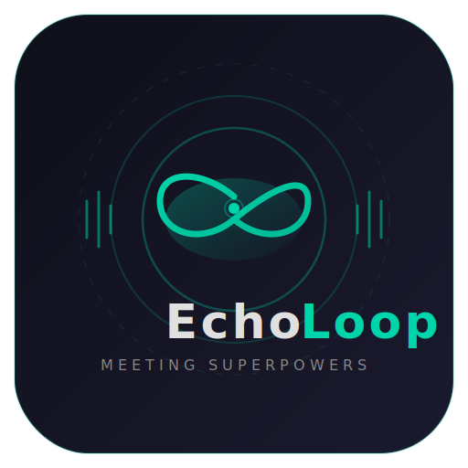

<p align="center">
  
</p>

<p align="center">
  <strong>Real-time AI meeting copilot that gives you superpowers.</strong><br/>
  <sub>Listen. Transcribe. Coach. Dominate. — All in real time.</sub>
</p>

<p align="center">
  <a href="#-quickstart"></a>
  
  
  
</p>

---

EchoLoop sits quietly on top of your Zoom, Teams, or Google Meet window. It captures what everyone's saying, transcribes it in real time, and feeds the live transcript to an LLM that acts as your personal executive coach — delivering sharp, tactical advice every few seconds.

Maybe you're prepping for a high-stakes negotiation. Maybe you're in back-to-back meetings and your brain checked out two calls ago. Or maybe you just don't feel like talking today and need a quiet co-pilot feeding you the right words at the right time. No judgement. We've all been there.

**Work smarter, not harder.**

> *"They sound hesitant on the budget — press now."*
> *"Ask for clarification on the timeline."*
> *"Pivot to the closing pitch."*

That's it. No fluff. Just signal.

## ✨ Features

| | Feature | Details |
|---|---------|---------|
| 🎙️ | **Dual audio capture** | System audio (what *they* say) + microphone (what *you* say), labelled separately |
| ⚡ | **Real-time transcription** | Local via [faster-whisper](https://github.com/SYSTRAN/faster-whisper) or cloud via [Deepgram](https://deepgram.com) — swappable with one env var |
| 🧠 | **LLM coaching loop** | Fires transcript to Claude or GPT every ~35s (or on conversation pauses) for punchy tactical advice |
| 🪟 | **Always-on-top overlay** | Semi-transparent, draggable Tkinter window — zero distraction |
| ⏸️ | **Pause / Resume** | One-click pause during small talk, resume when it matters |
| 🔇 | **Silence detection** | Skips dead air automatically — saves CPU and API calls |
| 📝 | **Session logging** | Optional transcript + insight log saved to disk for post-meeting review |
| 🔄 | **Parallel pipeline** | Audio, transcription, LLM, and UI never block each other |

## 🏗️ Architecture

```
┌───────────────┐     ┌──────────────┐     ┌──────────────┐     ┌────────────┐
│ Audio Capture  │────▶│  Transcriber │────▶│  EchoLoop    │────▶│     UI     │
│ (2 threads)    │     │ (thread pool)│     │  Engine      │     │  (Tkinter) │
│                │     │              │     │  (asyncio)   │     │            │
│ system ──┐     │     │ faster-whisper│     │              │     │ Always-on- │
│ mic ─────┤     │     │   or Deepgram│     │ Claude / GPT │     │ top overlay│
│          ▼     │     │              │     │ every ~35s   │     │            │
│  chunk queue   │     │  seg queue   │     │ + on silence │     │ insight log│
└───────────────┘     └──────────────┘     └──────────────┘     └────────────┘
       Thread               Thread              Async                Main
```

**Concurrency model:**

- **Audio capture** — two dedicated threads (one per stream, via `sounddevice`)
- **Transcription** — `ThreadPoolExecutor(2)` so both streams transcribe in parallel
- **LLM engine** — `asyncio` event loop for non-blocking API calls
- **UI** — main thread (Tkinter requirement), polls a thread-safe queue every 250ms
- **Bridging** — `queue.Queue` (thread↔async) and `asyncio.Queue` (async↔async)

## 🚀 Quickstart

### 1. Audio routing setup

EchoLoop needs to hear what's playing through your speakers. This requires a **virtual audio cable** that routes system audio into a capturable input device.

<details>
<summary><strong>Windows — VB-Cable (free)</strong></summary>

1. Download & install [VB-Cable](https://vb-audio.com/Cable/)
2. **Sound Settings → Output** → set to **CABLE Input**
3. To still hear audio yourself, install [VoiceMeeter Banana](https://vb-audio.com/Voicemeeter/banana.htm) (free) — it can duplicate audio to both the virtual cable and your real speakers
4. When EchoLoop starts, select **CABLE Output** as your system audio device

</details>

<details>
<summary><strong>macOS — BlackHole (free)</strong></summary>

1. `brew install blackhole-2ch`
2. Open **Audio MIDI Setup** → **+** → **Create Multi-Output Device**
3. Check both **BlackHole 2ch** and your real speakers
4. Set this Multi-Output as your system output
5. Select **BlackHole 2ch** as the system device in EchoLoop

</details>

<details>
<summary><strong>Linux — PulseAudio monitor</strong></summary>

```bash
pactl list sources short
# Look for: alsa_output.*.monitor
export ECHOLOOP_SYSTEM_DEVICE="monitor"
```

</details>

### 2. Install

```bash
git clone https://github.com/YOUR_USERNAME/EchoLoop.git
cd EchoLoop

python -m venv .venv
# Windows:
.venv\Scripts\activate
# macOS / Linux:
source .venv/bin/activate

pip install -r requirements.txt
```

**Optional — GPU acceleration for faster-whisper:**

```bash
pip install ctranslate2 --extra-index-url https://download.pytorch.org/whl/cu121
```

### 3. Configure

```bash
# Required — pick one LLM provider:
export ANTHROPIC_API_KEY="sk-ant-..."
# or
export OPENAI_API_KEY="sk-..."
export ECHOLOOP_LLM_PROVIDER="openai"

# Optional — give the LLM meeting context for sharper advice:
export ECHOLOOP_MEETING_CONTEXT="Sales call with VP Eng at Acme Corp, negotiating renewal"

# Optional — save transcripts for later:
export ECHOLOOP_LOG_DIR="$HOME/.echoloop/logs"
```

### 4. Run

```bash
python main.py
```

EchoLoop will list your audio devices, open the overlay, and start coaching.

## ⚙️ Configuration

All settings are controlled via environment variables. No config files to manage.

| Variable | Default | Description |
|----------|---------|-------------|
| `ECHOLOOP_SYSTEM_DEVICE` | *(interactive)* | Name substring of your virtual cable input |
| `ECHOLOOP_MIC_DEVICE` | *(default mic)* | Name substring of your microphone |
| `ECHOLOOP_TRANSCRIBER` | `local` | `local` (faster-whisper) or `deepgram` |
| `ECHOLOOP_WHISPER_MODEL` | `base.en` | Whisper model size (`tiny.en`, `base.en`, `small.en`, `medium.en`, `large-v3`) |
| `ECHOLOOP_WHISPER_DEVICE` | `cpu` | `cpu` or `cuda` |
| `ECHOLOOP_WHISPER_COMPUTE` | `int8` | `int8`, `float16`, or `float32` |
| `ECHOLOOP_LLM_PROVIDER` | `anthropic` | `anthropic` or `openai` |
| `ECHOLOOP_ANTHROPIC_MODEL` | `claude-sonnet-4-20250514` | Anthropic model ID |
| `ECHOLOOP_OPENAI_MODEL` | `gpt-4o` | OpenAI model ID |
| `ECHOLOOP_PUSH_INTERVAL` | `35` | Seconds between LLM coaching calls |
| `ECHOLOOP_SILENCE_TRIGGER` | `4.0` | Seconds of silence before early LLM trigger |
| `ECHOLOOP_ENERGY_THRESHOLD` | `0.005` | RMS below this = silence (skipped) |
| `ECHOLOOP_MEETING_CONTEXT` | *(empty)* | One-line meeting briefing prepended to transcript |
| `ECHOLOOP_LOG_DIR` | *(disabled)* | Directory for session transcript + insight logs |
| `ECHOLOOP_OPACITY` | `0.88` | Overlay window opacity (0.0–1.0) |
| `DEEPGRAM_API_KEY` | — | Required only if using Deepgram backend |

## 📂 Project Structure

```
EchoLoop/
├── main.py              # Orchestrator — wires everything together
├── config.py            # All settings (env-var driven)
├── audio_capture.py     # Dual-stream audio capture
├── transcriber.py       # faster-whisper / Deepgram, swappable
├── engine.py            # LLM coaching loop with smart triggers
├── ui.py                # Always-on-top Tkinter overlay
├── requirements.txt
├── SETUP.md             # Detailed audio routing guide
├── LICENSE
└── assets/
    └── logo.svg
```

## 🤝 Contributing

1. Fork the repo
2. Create a feature branch (`git checkout -b feat/my-feature`)
3. Commit your changes
4. Push and open a PR

## 📄 License

[MIT](LICENSE) — do whatever you want with it.

---

<p align="center">
  <sub>Built for people who refuse to leave a meeting without winning.</sub>
</p>
